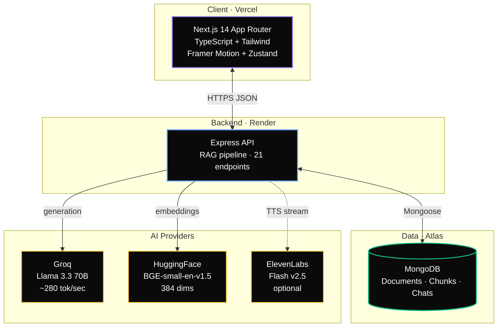

<!--
═══════════════════════════════════════════════════════════════════════════════
    N E X U S  —  A I   T H I N K I N G   W O R K S P A C E
═══════════════════════════════════════════════════════════════════════════════
-->

<div align="center">


</div>

<br/>

<div align="center">

<!-- Primary CTA row -->
<a href="https://ai-notebook-llm.vercel.app">
  
</a>
&nbsp;
<a href="#-quick-start">
  
</a>
&nbsp;
<a href="./DEPLOYMENT.md">
  
</a>
&nbsp;
<a href="#-api-surface">
  
</a>

<br/><br/>

<!-- Typed subtitle -->
<a href="#">
  
</a>

<br/><br/>

<!-- Core stack badges -->


<br/>


</div>

<br/>

---

<br/>

##  &nbsp; The Idea

Most AI tools answer questions. **Nexus does something different.** Upload your
research papers, course notes, articles, or meeting docs — and it starts
thinking *about* them. It notices where they agree, where they contradict,
what's missing. It generates questions you didn't think to ask. It turns
passive reading into active understanding.

Ten features. One premium dark-mode workspace. Voice-enabled end-to-end. Free
to run — no credit card anywhere in the stack.

<br/>

<div align="center">
  
</div>

<br/>

---

<br/>

##  &nbsp; Features

<div align="center">
  
</div>

<br/>

<details>
<summary><b>Detailed feature descriptions</b> — click to expand</summary>

<br/>

###  Multi-Document Chat
Ask anything across every uploaded document. Answers are grounded in retrieved
chunks, with clickable source citations and similarity scores. Keeps context
across turns within a conversation.

###  Smart Summary Engine
Short summary, key points, core concepts — per document or combined across
everything. Cached after generation; regenerable on demand.

###  Study Mode
Auto-generate flashcards with flip animations, multiple-choice quizzes with
scoring and per-question explanations, and predicted exam questions with full
model answers.

###  Cross-Document Insights
AI finds agreement, contradictions, extensions, analogies, and gaps between
your documents — the kind of thing you'd never ask about directly but want to
know.

###  Auto Insight Feed
Proactive ideas the AI surfaces without being asked. Fresh angles every
refresh, tagged by type (pattern, implication, question, contrast, connection).

###  Knowledge Gap Detector
Identifies missing concepts and prerequisites you need to fully understand the
material. Ranked by priority. Each gap includes 2–3 suggested learning paths.

###  Concept Battle
Head-to-head comparison of any two ideas. Strengths, weaknesses, when to use
each, a head-to-head table of dimensions, and a final verdict — all grounded in
evidence retrieved from your documents.

###  Knowledge Fusion
Synthesises multiple documents into one unified mental model. Thesis, pillars
with supporting evidence, a "how it all fits together" narrative, and the open
questions the fusion raises.

###  Confusion Detector
Surfaces commonly misunderstood concepts with plain-English fixes, real-world
analogies, and the things people mistake them for.

###  Voice Everywhere
Speaker button on every AI output. Free browser TTS by default (voice picker,
speed slider 0.5×–2×, persistent preferences), optional ElevenLabs premium
voices via top-right toggle. One audio stream at a time — clicking a new
speaker auto-stops the previous one.

</details>

<br/>

---

<br/>

##  &nbsp; How It Works

<div align="center">
  
</div>

<br/>

Six stages, end to end:

1. **Upload** — PDF, TXT, or Markdown (up to 20 MB per file)
2. **Extract** — `pdf-parse` pulls clean text out of the PDF
3. **Split** — paragraph-aware chunking with sentence fallback, 900 chars per chunk with 150 char overlap to preserve context
4. **Vectorize** — `BAAI/bge-small-en-v1.5` (384 dims) via HuggingFace Inference API, batched in 32s
5. **Persist** — chunks + embeddings + metadata go to MongoDB Atlas
6. **Ready** — retrieval uses in-memory cosine similarity top-K, generation via Groq's Llama 3.3 70B

Every feature (chat, insights, summaries, battles, fusion) builds on this
foundation. The RAG pipeline is the substrate; the ten features are the
thinking layers on top of it.

<br/>

---

<br/>

##  &nbsp; Architecture

<div align="center">



</div>

<br/>

<details>
<summary><b>Retrieval architecture deep-dive</b> — click to expand</summary>

<br/>

**Chunking** — Paragraph-aware with sentence fallback and character overlap.
Default 900 chars per chunk, 150 char overlap. Preserves semantic boundaries
better than hard character splits. See `backend/src/services/chunking.js`.

**Embeddings** — `BAAI/bge-small-en-v1.5` (384 dims) via HuggingFace Inference
API, batched in groups of 32. MTEB top-tier for its size, ~100–300 ms per
batch once the model is warm. First call after idle can take 10–20s for
HF's cold start. See `backend/src/services/embeddings.js`.

**Retrieval** — In-memory cosine similarity across all chunks. Efficient up to
~50k chunks (thousands of documents). For larger scale, swap to MongoDB Atlas
Vector Search — the `retrieveRelevantChunks` signature stays identical.
See `backend/src/services/retrieval.js`.

**Generation** — Groq, default `llama-3.3-70b-versatile` (~280 tok/sec, 131K
context window). Swap via `GROQ_MODEL` env var. Alternatives:
`llama-3.1-8b-instant` (faster), `openai/gpt-oss-120b`, `qwen/qwen3-32b`.
See `backend/src/services/llm.js`.

**TTS** — Browser Web Speech API as default (free, unlimited, zero setup,
works offline). Optional ElevenLabs `eleven_flash_v2_5` for premium voices,
proxied through the backend to keep API keys server-side. Hard 2500-char cap
on ElevenLabs requests to protect the free-tier quota. See
`frontend/src/hooks/useTTS.ts` and `backend/src/controllers/ttsController.js`.

</details>

<br/>

---

<br/>

##  &nbsp; Quick Start

<table>
<tr>
<td width="50%" valign="top">

###  Prerequisites

- Node.js **18+**
- MongoDB (local install or free [Atlas](https://mongodb.com/atlas) cluster)
- Groq API key — [free](https://console.groq.com/keys)
- HuggingFace token — [free](https://huggingface.co/settings/tokens) with *Inference Providers* permission
- ElevenLabs key — [optional](https://elevenlabs.io/app/settings/api-keys), 10k chars/mo free

</td>
<td width="50%" valign="top">

###  Setup Time

- Clone + install: **2 min**
- API keys: **3 min**
- Atlas cluster: **2 min**
- First run: **30 sec** (HF warmup)

Under **10 minutes** to a working local instance.

</td>
</tr>
</table>

### Backend

```bash
cd backend
npm install
cp .env.example .env
# Edit .env — set MONGO_URI, GROQ_API_KEY, HF_TOKEN
npm run dev
```

Look for `MongoDB connected` and `AI Notebook backend running on :5000`.

### Frontend

```bash
cd frontend
npm install
cp .env.local.example .env.local
# Edit .env.local — NEXT_PUBLIC_API_URL should match your backend
npm run dev
```

Open **http://localhost:3000**. Upload a document, wait 10–30 seconds for the
first embedding (HF cold-starts the model), and start exploring.

> ** Tip:** Three mock documents for testing are included in `mock-docs/` — a
> transformer architecture overview, a RAG systems guide, and a climate models
> essay. Upload all three at once and try the cross-document insights — they
> overlap in interesting ways.

<br/>

---

<br/>

<div align="center">
  
</div>

<br/>

---

<br/>

##  &nbsp; Project Structure

```
ai-notebook-llm/
│
├── backend/                              ◄─ Express API + MongoDB
│   ├── src/
│   │   ├── config/         db.js              MongoDB connection
│   │   ├── models/         Document · Chunk · Chat
│   │   ├── services/
│   │   │   ├── llm.js                         Groq wrapper
│   │   │   ├── embeddings.js                  HuggingFace embeddings
│   │   │   ├── chunking.js                    Paragraph-aware chunking
│   │   │   ├── retrieval.js                   Cosine similarity top-K
│   │   │   └── pdfParser.js                   PDF → text extraction
│   │   ├── controllers/
│   │   │   ├── documentController.js          Upload/list/delete
│   │   │   ├── chatController.js              RAG chat
│   │   │   ├── insightController.js           Summary · cross-doc · gaps
│   │   │   ├── studyController.js             Flashcards · MCQs · exam
│   │   │   ├── advancedController.js          Battle · fusion · confusion
│   │   │   └── ttsController.js               ElevenLabs proxy
│   │   ├── routes/         *.js               Express routers
│   │   ├── middleware/     upload.js · errorHandler.js
│   │   └── server.js                          Entry point
│   └── package.json
│
├── frontend/                             ◄─ Next.js 14 App Router
│   ├── src/
│   │   ├── app/
│   │   │   ├── page.tsx                       Main workspace
│   │   │   ├── layout.tsx                     Root layout + toaster
│   │   │   └── globals.css                    Dark theme tokens
│   │   ├── components/
│   │   │   ├── ui/                            SpeakerButton · Loading
│   │   │   ├── Sidebar.tsx                    Nav + document list
│   │   │   ├── TopBar.tsx                     Title + voice settings
│   │   │   ├── ChatInterface.tsx              RAG chat with sources
│   │   │   ├── WorkspaceView.tsx              Summary engine
│   │   │   ├── InsightsPanel.tsx              Auto feed + cross-doc
│   │   │   ├── StudyMode.tsx                  Flashcards · Quiz · Exam
│   │   │   ├── Flashcard.tsx                  Flip-animated card
│   │   │   ├── Quiz.tsx                       Scored MCQ
│   │   │   ├── ConceptBattle.tsx              Head-to-head compare
│   │   │   ├── KnowledgeFusion.tsx            Unified mental model
│   │   │   ├── ConfusionDetector.tsx          Misconception cards
│   │   │   ├── KnowledgeGapView.tsx           What to learn next
│   │   │   ├── DocumentUpload.tsx             Drag-and-drop modal
│   │   │   └── TTSSettings.tsx                Voice + engine picker
│   │   ├── hooks/          useTTS.ts          Browser + ElevenLabs orchestration
│   │   ├── lib/
│   │   │   ├── api.ts                         Typed axios client
│   │   │   └── utils.ts                       cn(), formatBytes, formatDate
│   │   ├── store/          useStore.ts        Zustand — docs, chat, TTS prefs
│   │   └── types/          index.ts           Shared TypeScript types
│   └── package.json
│
├── mock-docs/                            ◄─ Sample documents for testing
├── DEPLOYMENT.md                         ◄─ Full Render + Vercel + Atlas guide
└── README.md                             ◄─ You are here
```

<br/>

---

<br/>

##  &nbsp; API Surface

<details>
<summary><b>22 endpoints across 6 feature groups</b> — click to expand</summary>

<br/>

<table>
<thead>
<tr><th>Method</th><th>Path</th><th>Purpose</th></tr>
</thead>
<tbody>
<tr><td><code>GET</code></td><td><code>/api/health</code></td><td>Health check</td></tr>
<tr><td colspan="3"><b> Documents</b></td></tr>
<tr><td><code>POST</code></td><td><code>/api/documents/upload</code></td><td>Upload PDF / TXT / MD</td></tr>
<tr><td><code>GET</code></td><td><code>/api/documents</code></td><td>List documents</td></tr>
<tr><td><code>GET</code></td><td><code>/api/documents/:id</code></td><td>Get one document</td></tr>
<tr><td><code>DELETE</code></td><td><code>/api/documents/:id</code></td><td>Delete + cascade chunks</td></tr>
<tr><td colspan="3"><b> Chat</b></td></tr>
<tr><td><code>POST</code></td><td><code>/api/chat/message</code></td><td>RAG chat turn</td></tr>
<tr><td><code>GET</code></td><td><code>/api/chat</code></td><td>List chat sessions</td></tr>
<tr><td><code>GET</code></td><td><code>/api/chat/:id</code></td><td>Get chat with full history</td></tr>
<tr><td><code>DELETE</code></td><td><code>/api/chat/:id</code></td><td>Delete chat</td></tr>
<tr><td colspan="3"><b> Insights</b></td></tr>
<tr><td><code>GET</code></td><td><code>/api/insights/summary/:id</code></td><td>Summarise one document</td></tr>
<tr><td><code>GET</code></td><td><code>/api/insights/summary/all</code></td><td>Unified summary across all docs</td></tr>
<tr><td><code>GET</code></td><td><code>/api/insights/cross-document</code></td><td>Cross-document insights</td></tr>
<tr><td><code>GET</code></td><td><code>/api/insights/auto-feed</code></td><td>Proactive insight feed</td></tr>
<tr><td><code>GET</code></td><td><code>/api/insights/knowledge-gaps</code></td><td>What the user should learn next</td></tr>
<tr><td colspan="3"><b> Study</b></td></tr>
<tr><td><code>POST</code></td><td><code>/api/study/flashcards</code></td><td>Generate flashcards</td></tr>
<tr><td><code>POST</code></td><td><code>/api/study/mcqs</code></td><td>Generate multiple-choice quiz</td></tr>
<tr><td><code>POST</code></td><td><code>/api/study/exam-questions</code></td><td>Predict exam-style questions</td></tr>
<tr><td colspan="3"><b> Advanced</b></td></tr>
<tr><td><code>POST</code></td><td><code>/api/advanced/concept-battle</code></td><td>Compare two concepts</td></tr>
<tr><td><code>POST</code></td><td><code>/api/advanced/knowledge-fusion</code></td><td>Unified mental model</td></tr>
<tr><td><code>GET</code></td><td><code>/api/advanced/confusion-detector</code></td><td>Commonly misunderstood concepts</td></tr>
<tr><td colspan="3"><b> TTS</b></td></tr>
<tr><td><code>GET</code></td><td><code>/api/tts/status</code></td><td>Check if ElevenLabs is configured</td></tr>
<tr><td><code>POST</code></td><td><code>/api/tts/elevenlabs</code></td><td>Synthesise speech (streams MP3)</td></tr>
</tbody>
</table>

</details>

<br/>

---

<br/>

##  &nbsp; Deploy to Production

<br/>

<table>
<tr>
<th width="20%">Layer</th>
<th width="30%">Provider</th>
<th width="30%">Free Tier</th>
<th width="20%">Cold Start</th>
</tr>
<tr>
<td><b>Frontend</b></td>
<td>Vercel Hobby</td>
<td>Unlimited projects</td>
<td>None</td>
</tr>
<tr>
<td><b>Backend</b></td>
<td>Render Web Service</td>
<td>750 hrs/month</td>
<td>~30s after 15min idle</td>
</tr>
<tr>
<td><b>Database</b></td>
<td>MongoDB Atlas M0</td>
<td>512 MB storage</td>
<td>None</td>
</tr>
<tr>
<td><b>LLM</b></td>
<td>Groq</td>
<td>1000 RPM · 300K TPM</td>
<td>None</td>
</tr>
<tr>
<td><b>Embeddings</b></td>
<td>HuggingFace</td>
<td>Generous free tier</td>
<td>~20s first call</td>
</tr>
<tr>
<td><b>TTS (optional)</b></td>
<td>ElevenLabs</td>
<td>10k chars/month</td>
<td>~200ms</td>
</tr>
</table>

**Total monthly cost: $0.** No credit card required anywhere in this stack.

Full step-by-step walkthrough in **[`DEPLOYMENT.md`](./DEPLOYMENT.md)** —
20 minutes end-to-end from a fresh clone to a live deploy.

<br/>

---

<br/>

##  &nbsp; Design Decisions

<br/>

<table>
<tr>
<td width="33%" valign="top">

### Why Groq, not OpenRouter / OpenAI

Groq runs open-weight models on custom LPU hardware. Typically **3–10× faster**
than equivalent calls through other gateways. That speed difference makes the
chat UX feel real-time instead of *"waiting for an LLM"* — and for a
multi-step feature like cross-document insights, it's the difference between
**2 seconds and 20**.

</td>
<td width="33%" valign="top">

### Why HuggingFace, not OpenAI embeddings

Groq doesn't host embedding models, so we use HF's free Inference API for
`BAAI/bge-small-en-v1.5`. **MTEB top-tier** for its size, 384 dimensions
(fast to index and search), and truly free. The only trade-off is a **~20s
cold start** on the first call after idle — subsequent calls are fast.

</td>
<td width="33%" valign="top">

### Why browser TTS + optional ElevenLabs

Browser Web Speech API gives you unlimited free TTS with decent voices
(especially macOS). ElevenLabs is opt-in premium for when you want
human-quality narration — like sharing a demo or reading long-form content.
Both are isolated to one hook — trivial to swap providers.

</td>
</tr>
</table>

<br/>

---

<br/>

##  &nbsp; Roadmap

<br/>

<table>
<tr>
<td width="50%" valign="top">

### Shipped

- [x] Multi-document RAG chat with citations
- [x] Smart summary engine (per-doc + combined)
- [x] Study mode (flashcards / MCQ / exam)
- [x] Cross-document insight engine
- [x] Auto insight feed
- [x] Knowledge gap detector
- [x] Concept battle
- [x] Knowledge fusion
- [x] Confusion detector
- [x] TTS everywhere (browser + ElevenLabs)
- [x] Dark theme UI with premium polish
- [x] $0/month deploy recipe

</td>
<td width="50%" valign="top">

### Next up

- [ ] Streaming chat responses (SSE)
- [ ] Document-to-document query ("find passages in doc A that support claim in doc B")
- [ ] Atlas Vector Search for 50k+ chunk scale
- [ ] Multi-user auth (Clerk integration)
- [ ] Export study materials to Anki / Notion
- [ ] Mobile-responsive layout polish
- [ ] Speech-to-text input (talk to your documents)
- [ ] Collaborative workspaces
- [ ] Plugin system for custom insight generators

</td>
</tr>
</table>

<br/>

---

<br/>

##  &nbsp; Contributing

PRs welcome. Keep these principles in mind:

1. **Every feature should be RAG-grounded.** Don't make the LLM speak from its parametric knowledge when it could cite the user's documents.
2. **The dark theme is the default and the only theme.** It's part of the identity.
3. **Performance > Features.** A slow feature is a dead feature. Groq lets us ship quickly; don't erode that with chatty sequential calls.
4. **Accessibility is not optional.** Every interactive element needs keyboard + screen reader support.

Open an issue before starting on anything larger than a bug fix — alignment upfront saves everyone time.

<br/>

---

<br/>

##  &nbsp; License

[MIT](./LICENSE) — do what you want. Attribution appreciated but not required.

<br/>

---

<br/>

<div align="center">


&nbsp;

&nbsp;


<br/><br/>

<sub>Nexus turns reading into understanding.<br/>The goal was never a better chatbot — it was a better way to think across knowledge.</sub>

<br/><br/>

<a href="#">
  
</a>

</div>
